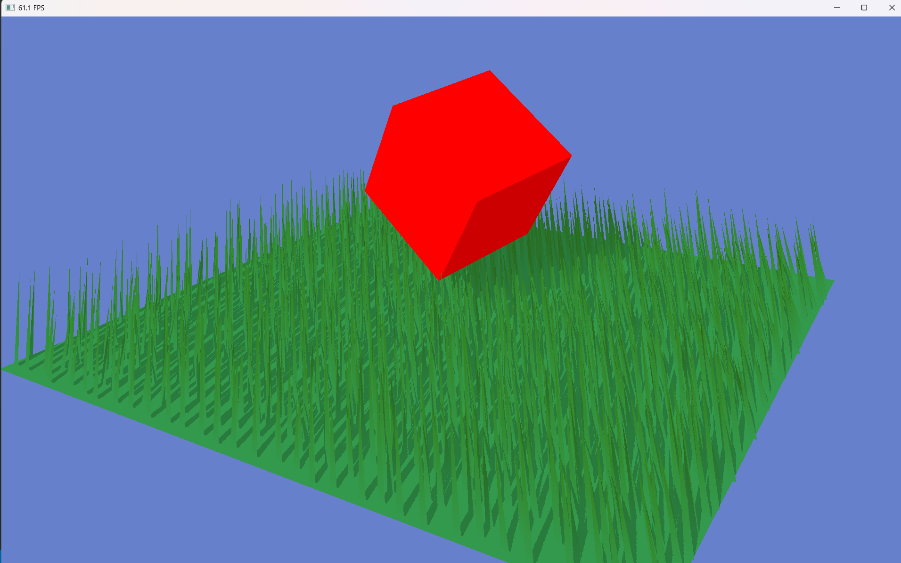

# OpenGL 4.6 Framework 

### Simplify work with OpenGL by avoiding boilerplate setups (work in progress)

## Features:
### Window
##### Avoids boilerplate setup and comes with different features like:
- Window **hints**
- Data getters (frame time, width, height)
- Managers (start draw, end draw, clear color)
#### Example
```cpp
int main()
{
    Window window; //vSync is ON automatically
    window.SetHint(HINT_UNRESIZABLE_WINDOW);
    window.Create(1000, 800, "test");
    while(!window.ShouldClose())
    {
      window.StartDrawing();
      window.ClearColor(1.f, 0.f, 0.f, 1.f); //rgba
      window.TitleFPS();
      window.EndDrawing();
    }
    return 0;
}
```
### Mesh
##### Comes with:
- Comes with it's own **model** matrix
- **Instancing** using transform matirces
- Mesh templates (cube, quad...) but can also be built in code
#### Example
```cpp
Mesh cube = Mesh::createColoredCube(glm::vec3(1.f, 0.f, 0.f)); //red color
cube.model = glm::scale(cube.model, glm::vec3(0.5f));
/*Make an array of 4x4 matrices (std::vector<glm::mat4> matricesArr)*/
cube.SetInstanceTransforms(matricesArr);
...
while(...)
{
  ...
  /*Use simple Shader Program*/
  cube.Draw()
  /*Use instanced Shader Program*/
  cube.DrawInstanced(matricesArr.size());
  ...
}
```
### Framebuffers
##### Can be used for:
- **Post-processing**
- **Shadows**
- Debugging
#### Example (for shadows)
```cpp
int main()
{
  ScreenFramebuffer sFB(window.GetWidth(), window.GetHeight());
  DepthFramebuffer dFB(window.GetWidth(), window.GetHeight());
  ...
  while(...)
  {
    ...
    //preparing the shadow texture (dFB.tex)
    dFB.Bind();
    dFB->depthShader.Use(); //there can also be a custom shader, depthShader is for simple/static meshes
    /*Render scene*/
    dFB.Unbind();

    //clearing window to draw the scene
    glEnable(GL_DEPTH_TEST);
    window.ClearColor((GLbitfield)GL_COLOR_BUFFER_BIT | GL_DEPTH_BUFFER_BIT, 0.5f, 0.5f, 0.5f, 1.f);
    
    //applying the shadow texture to the scene with special shader
    shadowedShader.Use(); //Shader shadowedShader(SHADOWED_..._SHADER);
    dFB.tex->Bind(0);
    shadowedShader.SetUniformInt("shadowMap", 0);
    shadowedShader.SetUniformFloat("shadowDarkness", 0.2f);
    mesh.Draw();
    ...
  }
}
...
```

### Shaders, Camera, Input...
##### The framework has many shader templates, a simple camera implementation and input setup and managing:
#### Example
```cpp
Shader simpleShader(POSITION_COLOR_SHADER);
Shader instancedShader(POSITION_COLOR_SHADER_INSTANCED);

Camera camera; //can take parameters
camera.SetSensitivity(1.f);
camera.SetProjectionToPersp(45.f, window.GetWidth(), window.GetHeight(), .1f, 100.f);
/*For now, callbacks must be set manually*/

Input input(window.GetHandler()); //prepares a vectors for keys & mouse button states
...
```

## Example of what can be achieved with the Framework



### Others
Comes with a Makefile for automatic compilation of the /utils & /src directories